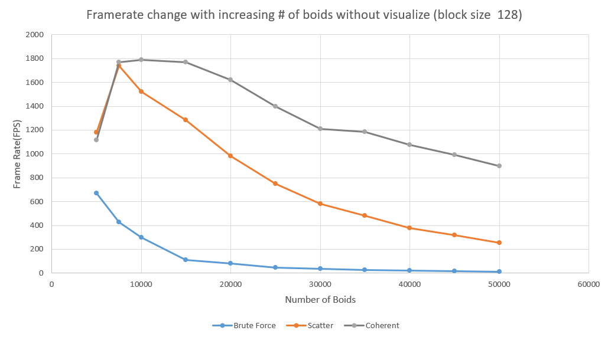
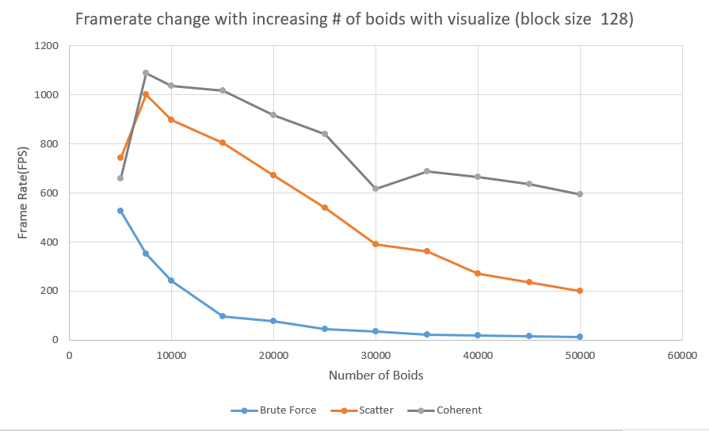
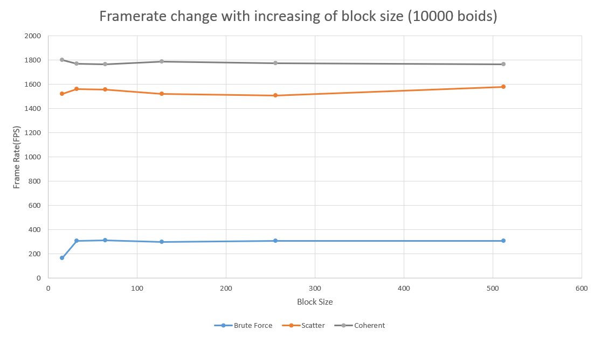

**University of Pennsylvania, CIS 565: GPU Programming and Architecture,
Project 1 - Flocking**

* Siyu Zheng
  * [LinkedIn](https://www.linkedin.com/in/siyu-zheng-b3b38aa8/)
* Tested on: Tested on: Tested on: Windows 10, i7-8750 @ 2.20GHz 16GB, GTX 1060 6GB (Personal Laptop)

## Result

Simulation using coherent grids when boids number is 20000 and block size is 128.

## Performance Analysis

Framerate change with increasing # of boids for naive, scattered uniform grid, and coherent uniform grid (with and without visualization)

Framerate change with increasing block size

* For each implementation, how does changing the number of boids affect
performance? Why do you think this is?

From the graph, we can see that as the number of boids increase, the framerate of naive, scatter and coherent implementation are all decreasing. This is because the incresing of boids will require more calculation on neighbor/all other boids. Among these three implementation, the naive approach has the lowest fps since it need to check more boids than other two implementation. Using uniform grid can significantly increase the performance. What's more, a uniform grid with semi-coherent memory access has the best performance since it optimize the memory access than scattered approach.

In my experiment I also found that in some certain points the framerate will change a lot. From boids number 1280 to 1281, the framerate drop from around 1800 to around 1100. From boids number 5461 to 5462, the framerate increase from 1100 to 1800. 

* For each implementation, how does changing the block count and block size
affect performance? Why do you think this is?

From the graph, we observed that as the block size change from 16 to 512 (the multiple of 32), the performance didn't change much. When block size is 16 which is less than warp size, the framerate of the brute force implementation is the lowest. This might due to the warp is not sufficiently used.

* For the coherent uniform grid: did you experience any performance improvements
with the more coherent uniform grid? Was this the outcome you expected?
Why or why not?

In my coherent uniform grid test, the performance improve quite a lot. This is because it access coherent memory. The program are likely to write a lots of bytes in small chunks. So if we perform data operation in random pointers, it will cost expensive memory access. With coherent memory storage, we can access contiguous memory to has less expensive cost.

* Did changing cell width and checking 27 vs 8 neighboring cells affect performance?
Why or why not? Be careful: it is insufficient (and possibly incorrect) to say
that 27-cell is slower simply because there are more cells to check!

Yes. Checking 27 neighboring will require more memory and more cach miss will occur.

| 10000 boids        | 8 neighbors          | 27 neighbors  |
| ------------- |:-------------:| -----:|
| scattered      | 1346.6 | 1229.9 |
| coherent      | 1838.9      |   1534.2 |

| 20000 boids        | 8 neighbors          | 27 neighbors  |
| ------------- |:-------------:| -----:|
| scattered      | 783.8 | 1534.2 |
| coherent      | 1486.5      |   1156.6 |

For my own experiment, the implementation of 8 neighbors has better performance thant 27 neighbors.